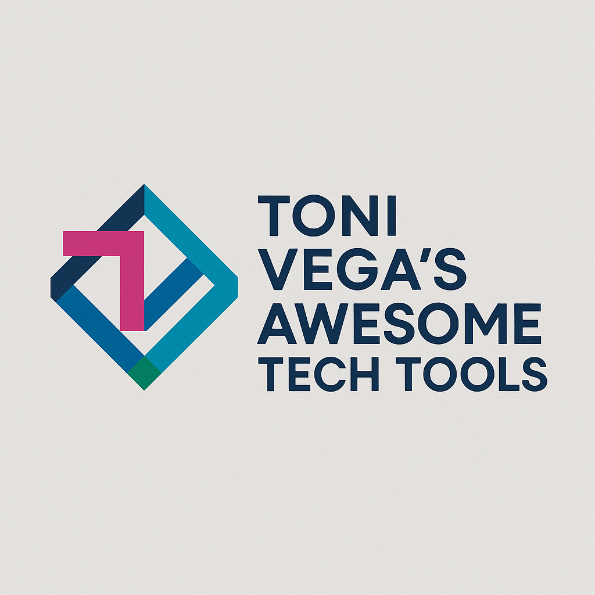
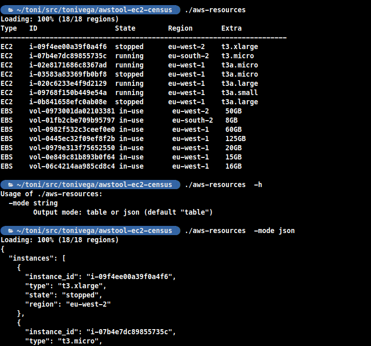

# 🚀 Toni Vega / Awesome Things

<div align="center">
  
  <h3>⚡ Curated list of developer tools, utilities, and workflows <b>I've built</b>, use & recommend</h3>
  <p>✨ Productivity • 🛠️ DevOps • 💻 Coding • 🌐 Web • 🔒 Security</p>
  
  [](https://awesome.re) 
   
  
</div>

---

## 📸 Featured Tools

| Tool | Preview | Description |
|------|---------|-------------|
| **aws-resources** |  | Standalone CLI command for simple listing of AWS EC2 and EBS resources for all regions |

---

## 🔥 Categories

<details>
  <summary>🛠️ DevOps & Infrastructure</summary>
  
  - [aws-resources](aws-resources) – Standalone CLI command for simple listing of AWS EC2 and EBS resources for all regions.  

</details>

<details>
  <summary>💻 Developer Productivity</summary>


</details>

<details>
  <summary>📊 Monitoring & Logging</summary>


</details>

<details>
  <summary>🔒 Security & Networking</summary>


</details>

---

## 🌟 How to Contribute
Pull requests welcome! Just add tools under the right section.  
For images, drop them in `/assets/img/` and reference them like:

```markdown

